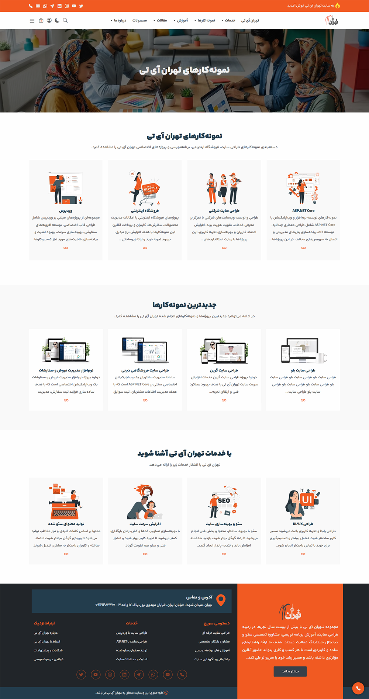
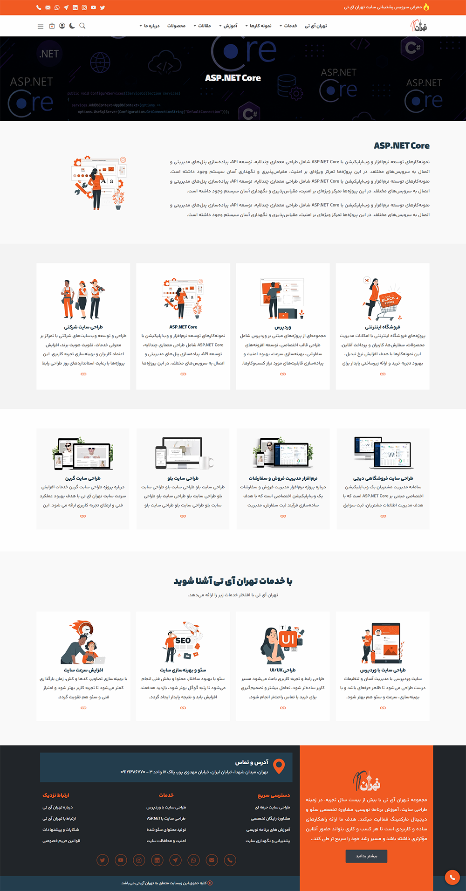
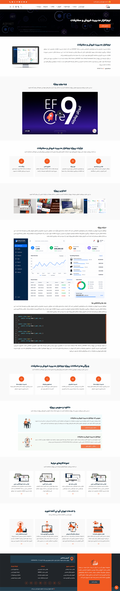
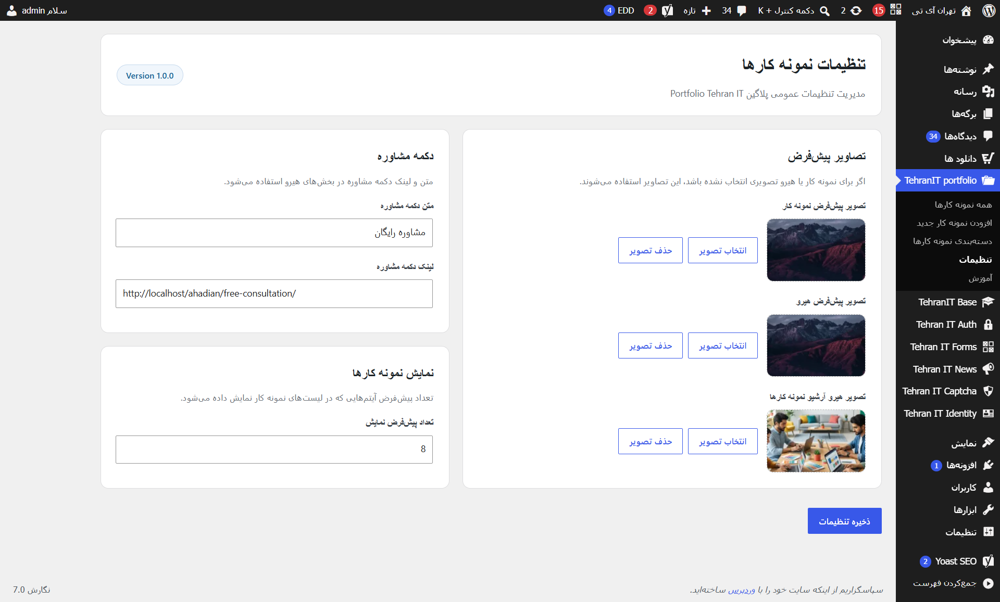
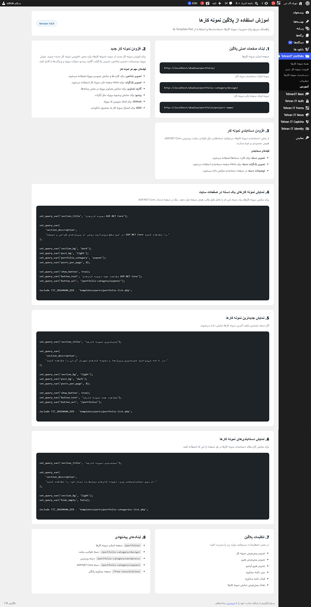

# Portfolio Tehran IT

A lightweight, developer-focused WordPress portfolio plugin built for custom themes, agencies, freelancers, and professional portfolio websites.

🇮🇷 Persian Documentation:

[README.fa.md](README.fa.md)

---

## About

Portfolio Tehran IT is a flexible and extensible WordPress portfolio plugin designed for developers who need full control over portfolio structure, templates, custom fields, frontend output, and theme integration.

Unlike many portfolio plugins that target general users or drag-and-drop page builders, this plugin is built primarily for WordPress developers and agencies that require a clean, customizable, and maintainable portfolio system.

The plugin provides a modern portfolio architecture based on:

- Custom Post Types
- Custom Taxonomies
- Custom Fields
- Reusable Template Parts
- Global Settings
- SEO-Friendly Markup
- Schema.org Integration

---

## Features

### Portfolio Management

- Portfolio Custom Post Type
- Portfolio Categories
- Portfolio Archive Page
- Portfolio Category Pages
- Single Portfolio Pages

### Project Content

- Featured Image
- Hero Image
- Image Gallery
- Video Support (Aparat & YouTube)
- Project Features
- Project Details
- Project Description

### Project Resources

- GitHub Repository Link
- Download Link
- Related Projects Section

### Developer Features

- Reusable Template Parts
- Helper Functions
- Theme-Friendly Architecture
- Modular Structure
- Easy Customization
- Extendable Codebase

### SEO Features

- Semantic HTML Structure
- Schema.org Markup
- SEO-Friendly Portfolio Pages
- Accessible Markup
- Optimized Heading Structure

---

## Screenshots

### Portfolio



### Portfolio Categories



### Single Portfolio Page



### Portfolio Settings



### Portfolio documentation



---

## Who Is This Plugin For?

Portfolio Tehran IT is mainly designed for:

- WordPress Developers
- WordPress Theme Developers
- Freelancers
- Web Agencies
- PHP Developers
- Software Developers
- Developers who need full control over frontend structure

---

## Who Is This Plugin Not For?

This plugin is not designed for users who:

- Need a drag-and-drop portfolio builder
- Depend entirely on page builders
- Want visual customization without coding
- Expect all functionality to be managed from the admin panel

The primary goal of this project is to provide a clean and extensible portfolio framework for developers.

---

## Project Structure

```text
portfolio-tehran-it/
│
├── assets/
│
├── docs/
│   └── screenshots/
│
├── helpers/
├── includes/
├── languages/
├── templates/
│
├── README.md
├── README.fa.md
├── CHANGELOG.md
├── LICENSE
└── portfolio-tehran-it.php
```

---

## Portfolio Features

Each portfolio item can include:

- Project Title
- Project Description
- Featured Image
- Hero Image
- Image Gallery
- Project Video
- Project Features
- Project Details
- GitHub Link
- Download Link
- Related Projects
- Portfolio Category

---

## Plugin Settings

The plugin includes a settings page for managing:

- Default Portfolio Image
- Default Hero Image
- Archive Hero Image
- Consultation Button Text
- Consultation Button URL
- Default Portfolio Display Count

These settings act as global fallback values throughout the plugin.

---

## Template Parts

The plugin includes reusable template parts that can be integrated into custom themes.

```php
templates/parts/portfolio-list.php
templates/parts/portfolio-categories-list.php

templates/parts/archive-hero.php
templates/parts/archive-categories.php
templates/parts/archive-latest-portfolios.php

templates/parts/project-hero.php
templates/parts/project-introduction.php
templates/parts/project-details.php
templates/parts/project-features.php
templates/parts/project-video.php
templates/parts/project-gallery.php
templates/parts/project-content.php
templates/parts/project-downloads.php
templates/parts/project-related.php

templates/parts/taxonomy-hero.php
templates/parts/taxonomy-description.php
templates/parts/taxonomy-sub-categories.php
templates/parts/taxonomy-posts.php
```

---

## Helper Functions

Get plugin settings:

```php
tit_20260606_get_setting(
    'consultation_button_text'
);
```

Get image URL from settings:

```php
tit_20260606_get_setting_image_url(
    'default_image'
);
```

Get project features:

```php
tit_20260606_get_project_features(
    get_the_ID()
);
```

Get project details:

```php
tit_20260606_get_project_details(
    get_the_ID()
);
```

---

## Usage Example

Display latest portfolio items:

```php
set_query_var(
    'section_title',
    'Latest Portfolio Projects'
);

set_query_var(
    'section_description',
    'Explore some of the latest portfolio projects.'
);

set_query_var('section_bg', 'light');
set_query_var('post_bg', 'dark');
set_query_var('posts_per_page', 8);

include TIT_20260606_DIR . 'templates/parts/portfolio-list.php';
```

Display projects from a specific category:

```php
set_query_var(
    'section_title',
    'ASP.NET Core Projects'
);

set_query_var(
    'section_description',
    'Selected ASP.NET Core portfolio projects.'
);

set_query_var(
    'portfolio_category',
    'aspnet'
);

include TIT_20260606_DIR . 'templates/parts/portfolio-list.php';
```

Display portfolio slider categories:

```php
set_query_var(
    'section_title',
    'Portfolio Categories'
);

set_query_var(
    'section_description',
    'Browse portfolio projects by category.'
);

include TIT_20260606_DIR . 'templates/parts/portfolio-categories-list.php';
```

Display portfolio grid categories:

```php
set_query_var(
    'section_title',
    'دسته‌بندی نمونه کارها'
);

set_query_var(
    'section_description',
    'از بین دسته‌بندی‌های زیر، نمونه کارهای مرتبط با نیاز خود را مشاهده کنید.'
);

set_query_var('section_bg', 'light');
set_query_var('post_bg', 'dark');
set_query_var('hide_empty', false);

include TIT_20260606_DIR . 'templates/parts/portfolio-categories-grid.php';
```

---

## Default URLs

Portfolio archive:

```text
/portfolio/
```

Portfolio category:

```text
/portfolio-category/aspnet/
```

Single portfolio page:

```text
/portfolio/project-name/
```

---

## Design Philosophy

The goal of Portfolio Tehran IT is to provide a lightweight and developer-friendly portfolio framework.

This project focuses on:

- Reducing unnecessary dependencies
- Maintaining a modular codebase
- Creating reusable template parts
- Giving developers full control over frontend output
- Avoiding page-builder dependency
- Keeping portfolio pages SEO-friendly
- Making customization easy

Portfolio Tehran IT is closer to a portfolio framework than a traditional portfolio builder plugin.

---

## Roadmap

### Version 1.0

- [x] Portfolio Post Type
- [x] Portfolio Categories
- [x] Portfolio Archive
- [x] Portfolio Category Pages
- [x] Single Portfolio Pages
- [x] Portfolio Gallery
- [x] Portfolio Video
- [x] Project Downloads
- [x] Related Projects
- [x] Global Settings
- [x] Reusable Template Parts
- [x] Helper Functions

### Future Versions

- [ ] Featured Portfolio
- [ ] Portfolio Ordering
- [ ] Portfolio Statistics
- [ ] Advanced Documentation
- [ ] Additional Helper Functions
- [ ] REST API Support
- [ ] Additional Template Parts

---

## Requirements

- WordPress 6.0+
- PHP 8.0+

---

## License

GPL-2.0 or later

https://www.gnu.org/licenses/gpl-2.0.html

---

## Author

**Mohammadreza Ahadian (Tehran IT)**

Professional WordPress solutions, custom plugin development, and custom web applications.

Website: https://tehranit.net

GitHub: https://github.com/ahadian2